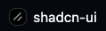

<table width="100%">
  <tr>
    <td align="left">
      <h1>Fumadocs</h1>
      
    </td>
    <td align="right">
      <h1>Shadcn/UI</h1>
      
    </td>
  </tr>
</table>

# Fumadocs Shadcn/UI Registry Template

This is a comprehensive template for creating your own component registry for `shadcn/ui`, seamlessly integrated with [Fumadocs](https://fumadocs.dev/) for documentation. Build, document, and distribute your own reusable components to any React project that uses `shadcn/ui`.

## 📚 Table of Contents

- [🚀 Features](#-features)
- [📋 Tech Stack](#-tech-stack)
- [📁 Project Structure](#-project-structure)
- [🛠 Available Scripts](#-available-scripts)
- [🚀 Getting Started](#-getting-started)
- [📝 Creating New Components](#-creating-new-components)
- [📚 Creating Component Documentation](#-creating-component-documentation)
- [🌐 Deploying Your Registry](#-deploying-your-registry)
- [📦 Using Your Registry](#-using-your-registry)
- [🔧 Configuration](#-configuration)
- [🤝 Contributing](#-contributing)
- [📄 License](#-license)
- [🙏 Acknowledgments](#-acknowledgments)
- [📞 Support](#-support)

## 🚀 Features

- **Custom Component Registry**: Host your own `shadcn/ui` compatible components
- **Integrated Documentation**: Uses [Fumadocs](https://fumadocs.dev/) to automatically generate documentation
- **`shadcn/ui` Compatible**: Components can be added to any `shadcn/ui` project using the CLI
- **Example Components**: Includes examples of simple and complex components with hooks and helper files
- **TypeScript Support**: Full TypeScript support with proper type definitions
- **Modern Build System**: Built with Next.js 15 and Turbopack for fast development
- **Automated Registry**: Components are automatically built and served via API routes

## 📋 Tech Stack

### Core Framework
- **Next.js 15.4.4** - React framework with App Router
- **React 19.1.0** - UI library
- **TypeScript 5.8.3** - Type safety

### Documentation
- **Fumadocs Core 15.5.3** - Documentation framework
- **Fumadocs UI 15.5.3** - Pre-built documentation components
- **Fumadocs MDX 11.6.9** - MDX processing for docs

### UI Components
- **Shadcn/UI 2.4.0** - Component system
- **Radix UI** - Headless UI primitives
- **Tailwind CSS 4.1.10** - Utility-first CSS framework
- **Lucide React** - Icon library
- **Class Variance Authority** - Component variant management

### Development Tools
- **ESLint** - Code linting
- **Prettier** - Code formatting
- **Husky** - Git hooks
- **Lint-staged** - Pre-commit linting

### Validation & Utilities
- **Zod 3.25.67** - Schema validation
- **clsx & tailwind-merge** - Conditional class utilities

## 📁 Project Structure

```
fumadocs-shadcnui-registry-template/
├── app/                          # Next.js App Router
│   ├── (home)/                   # Home page group
│   │   ├── layout.tsx           # Home layout
│   │   └── page.tsx             # Landing page
│   ├── docs/                    # Documentation pages
│   │   ├── [[...slug]]/         # Dynamic docs routing
│   │   │   └── page.tsx         # Doc page renderer
│   │   └── layout.tsx           # Docs layout
│   ├── registry/                # Component registry API
│   │   └── [name]/              # Dynamic component routes
│   │       └── route.ts         # Component API endpoint
│   ├── api/                     # API routes
│   │   └── search/              # Search functionality
│   │       └── route.ts         # Search API
│   ├── layout.tsx               # Root layout
│   ├── layout.config.tsx        # Layout configuration
│   └── global.css               # Global styles
├── components/                   # Shared components
│   ├── ui/                      # UI components (shadcn/ui)
│   │   ├── button.tsx           # Button component
│   │   ├── card.tsx             # Card component
│   │   ├── dialog.tsx           # Dialog component
│   │   ├── input.tsx            # Input component
│   │   └── ...                  # Other UI components
│   ├── app-logo.tsx             # Application logo
│   └── open-in-v0-button.tsx    # V0 integration button
├── content/                     # Documentation content
│   └── docs/                    # Documentation files
│       ├── index.mdx            # Main documentation
│       └── test.mdx             # Example documentation
├── lib/                         # Utility libraries
│   ├── source.ts                # Documentation source config
│   └── utils.ts                 # Utility functions
├── public/                      # Static assets
│   ├── r/                       # Registry JSON files
│   │   ├── hello-world.json     # Component definitions
│   │   ├── example-form.json    # Form component
│   │   ├── complex-component.json # Complex component
│   │   └── example-with-css.json # CSS example
│   ├── fumadocs-logo.png        # Fumadocs logo
│   └── shadcnui-logo.png        # Shadcn/ui logo
├── registry/                    # Component registry
│   └── new-york/                # New York style variant
│       ├── ui/                  # Base UI components
│       │   ├── button.tsx       # Registry button
│       │   ├── card.tsx         # Registry card
│       │   ├── input.tsx        # Registry input
│       │   ├── label.tsx        # Registry label
│       │   └── textarea.tsx     # Registry textarea
│       └── blocks/              # Complex components
│           ├── hello-world/     # Simple component example
│           │   └── hello-world.tsx
│           ├── example-form/    # Form component example
│           │   └── example-form.tsx
│           ├── complex-component/ # Advanced component example
│           │   ├── components/  # Sub-components
│           │   │   ├── pokemon-card.tsx
│           │   │   ├── pokemon-image.tsx
│           │   │   └── pokemon-page.tsx
│           │   ├── hooks/       # Custom hooks
│           │   │   └── use-pokemon.ts
│           │   └── lib/         # Utility functions
│           │       └── pokemon.ts
│           └── example-with-css/ # CSS example
│               ├── example-card.tsx
│               └── example-card.css
├── registry.json               # Registry configuration
├── components.json             # Shadcn/ui configuration
├── source.config.ts            # Documentation source config
├── next.config.ts              # Next.js configuration
├── tailwind.config.ts          # Tailwind CSS configuration
├── tsconfig.json               # TypeScript configuration
├── package.json                # Dependencies and scripts
└── README.md                   # This file
```

## 🛠 Available Scripts

| Script | Description |
|--------|-------------|
| `pnpm dev` | Start development server with Turbopack |
| `pnpm build` | Build the application for production |
| `pnpm start` | Start production server |
| `pnpm lint` | Check code formatting and linting |
| `pnpm lint:fix` | Fix linting and formatting issues |
| `pnpm format` | Format code with Prettier |
| `pnpm registry:build` | Build component registry |
| `pnpm postinstall` | Run Fumadocs MDX processing |

## 🚀 Getting Started

### 1. Use This Template

Click the "Use this template" button on the GitHub repository page to create your own repository based on this template.

### 2. Install Dependencies

```bash
# Clone your repository
git clone https://github.com/your-username/your-registry-name.git
cd your-registry-name

# Install dependencies
pnpm install
```

### 3. Customize Your Registry

Open `registry.json` and customize it to your needs:

```jsonc
// registry.json
{
  "$schema": "https://ui.shadcn.com/schema/registry.json",
  "name": "your-registry-name",        // Change this
  "homepage": "https://your-site.com", // Change this
  "items": [
    // ... your components
  ]
}
```

### 4. Start Development

```bash
# Start the development server
pnpm dev
```

Open [http://localhost:3000](http://localhost:3000) to see your registry documentation.

## 📝 Creating New Components

### Step 1: Create Component Files

1. **Create component directory**:
   ```bash
   mkdir -p registry/new-york/blocks/my-component
   ```

2. **Add your component**:
   ```tsx
   // registry/new-york/blocks/my-component/my-component.tsx
   import { Button } from "@/components/ui/button"
   
   export function MyComponent() {
     return (
       <div className="p-4">
         <Button>My Custom Component</Button>
       </div>
     )
   }
   ```

### Step 2: Register Component

Add your component to `registry.json`:

```jsonc
{
  "name": "my-component",
  "type": "registry:component",
  "title": "My Component",
  "description": "Description of my component",
  "registryDependencies": ["button"], // shadcn/ui dependencies
  "dependencies": ["zod"],            // npm dependencies (optional)
  "files": [
    {
      "path": "registry/new-york/blocks/my-component/my-component.tsx",
      "type": "registry:component"
    }
  ]
}
```

### Step 3: Build Registry

```bash
pnpm registry:build
```

This generates the component JSON files in the `public/r/` directory.

### Step 4: Create Documentation

Create a documentation file:

```mdx
---
title: My Component
description: Learn how to use My Component
---

# My Component

This is my custom component that does amazing things.

## Usage

```tsx
import { MyComponent } from "@/components/my-component"

export default function App() {
  return <MyComponent />
}
```

## Preview

import { MyComponent } from "@/registry/new-york/blocks/my-component/my-component"

<MyComponent />
```

### Advanced Component Structure

For complex components with multiple files:

```
registry/new-york/blocks/advanced-component/
├── components/           # Sub-components
│   ├── header.tsx
│   └── footer.tsx
├── hooks/               # Custom hooks
│   └── use-advanced.ts
├── lib/                 # Utility functions
│   └── utils.ts
└── advanced-component.tsx # Main component
```

Register all files in `registry.json`:

```jsonc
{
  "name": "advanced-component",
  "type": "registry:component",
  "files": [
    {
      "path": "registry/new-york/blocks/advanced-component/advanced-component.tsx",
      "type": "registry:component"
    },
    {
      "path": "registry/new-york/blocks/advanced-component/components/header.tsx",
      "type": "registry:component"
    },
    {
      "path": "registry/new-york/blocks/advanced-component/hooks/use-advanced.ts",
      "type": "registry:hook"
    },
    {
      "path": "registry/new-york/blocks/advanced-component/lib/utils.ts",
      "type": "registry:lib"
    }
  ]
}
```

## 📚 Creating Component Documentation

### Basic Documentation Structure

Create MDX files in the `content/docs/` directory:

```mdx
---
title: Component Name
description: Brief description of the component
---

# Component Name

Detailed description and usage instructions.

## Installation

```bash
npx shadcn-ui@latest add component-name --registry https://your-registry-url.com
```

## Usage

```tsx
import { ComponentName } from "@/components/component-name"

export default function App() {
  return <ComponentName />
}
```

## Examples

### Basic Example

import { ComponentName } from "@/registry/new-york/blocks/component-name/component-name"

<ComponentName />

### Advanced Example

<ComponentName variant="advanced" />

## API Reference

| Prop | Type | Default | Description |
|------|------|---------|-------------|
| `variant` | `string` | `"default"` | Component variant |
| `size` | `string` | `"md"` | Component size |
```

### Documentation Best Practices

1. **Include live examples** using component imports
2. **Provide API documentation** with prop tables
3. **Show multiple variants** and use cases
4. **Include installation instructions**
5. **Add accessibility notes** where relevant

## 🌐 Deploying Your Registry

### 1. Deploy to Vercel (Recommended)

```bash
# Install Vercel CLI
npm i -g vercel

# Deploy
vercel --prod
```

### 2. Deploy to Netlify

1. Connect your GitHub repository to Netlify
2. Set build command: `pnpm build`
3. Set publish directory: `.next`

### 3. Deploy to Other Platforms

The built application is a standard Next.js app and can be deployed to any platform that supports Node.js.

## 📦 Using Your Registry

Once deployed, users can add your components to their projects:

```bash
# Add a single component
npx shadcn-ui@latest add my-component --registry https://your-registry-url.com

# Add multiple components
npx shadcn-ui@latest add component-1 component-2 --registry https://your-registry-url.com
```

### Setting as Default Registry

Users can set your registry as their default in `components.json`:

```jsonc
{
  "$schema": "https://ui.shadcn.com/schema.json",
  "style": "new-york",
  "rsc": true,
  "tsx": true,
  "tailwind": {
    "config": "tailwind.config.ts",
    "css": "app/globals.css",
    "baseColor": "slate",
    "cssVariables": true,
    "prefix": ""
  },
  "aliases": {
    "components": "@/components",
    "utils": "@/lib/utils"
  },
  "registry": "https://your-registry-url.com" // Your registry URL
}
```

## 🔧 Configuration

### Fumadocs Configuration

Customize documentation in `source.config.ts`:

```ts
import { defineDocs, defineConfig } from 'fumadocs-mdx/config'

export const { docs, meta } = defineDocs({
  dir: 'content/docs',
})

export default defineConfig({
  mdxOptions: {
    // MDX options
  },
})
```

### Tailwind Configuration

Extend Tailwind in `tailwind.config.ts`:

```ts
import type { Config } from "tailwindcss"

const config: Config = {
  content: [
    "./pages/**/*.{js,ts,jsx,tsx,mdx}",
    "./components/**/*.{js,ts,jsx,tsx,mdx}",
    "./app/**/*.{js,ts,jsx,tsx,mdx}",
    "./content/**/*.{js,ts,jsx,tsx,mdx}",
    "./registry/**/*.{js,ts,jsx,tsx,mdx}",
  ],
  theme: {
    extend: {
      // Your custom theme
    },
  },
  plugins: [],
}

export default config
```

## 🤝 Contributing

1. Fork the repository
2. Create a feature branch: `git checkout -b feature/amazing-component`
3. Add your component following the structure above
4. Create documentation for your component
5. Test your component: `pnpm dev`
6. Build the registry: `pnpm registry:build`
7. Commit your changes: `git commit -m 'Add amazing component'`
8. Push to the branch: `git push origin feature/amazing-component`
9. Open a Pull Request

## 📄 License

This project is licensed under the MIT License - see the [LICENSE](LICENSE) file for details.

## 🙏 Acknowledgments

- [Shadcn/UI](https://ui.shadcn.com/) for the amazing component system
- [Fumadocs](https://fumadocs.dev/) for the documentation framework
- [Radix UI](https://www.radix-ui.com/) for the headless UI primitives
- [Tailwind CSS](https://tailwindcss.com/) for the utility-first CSS framework

## 📞 Support

If you have any questions or need help, please:

1. Check the [documentation](https://fumadocs.dev/)
2. Search existing [issues](https://github.com/your-username/your-registry-name/issues)
3. Create a new [issue](https://github.com/your-username/your-registry-name/issues/new)

---

**Happy coding! 🎉**